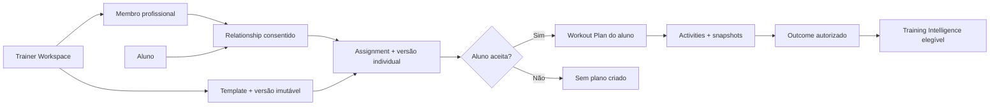
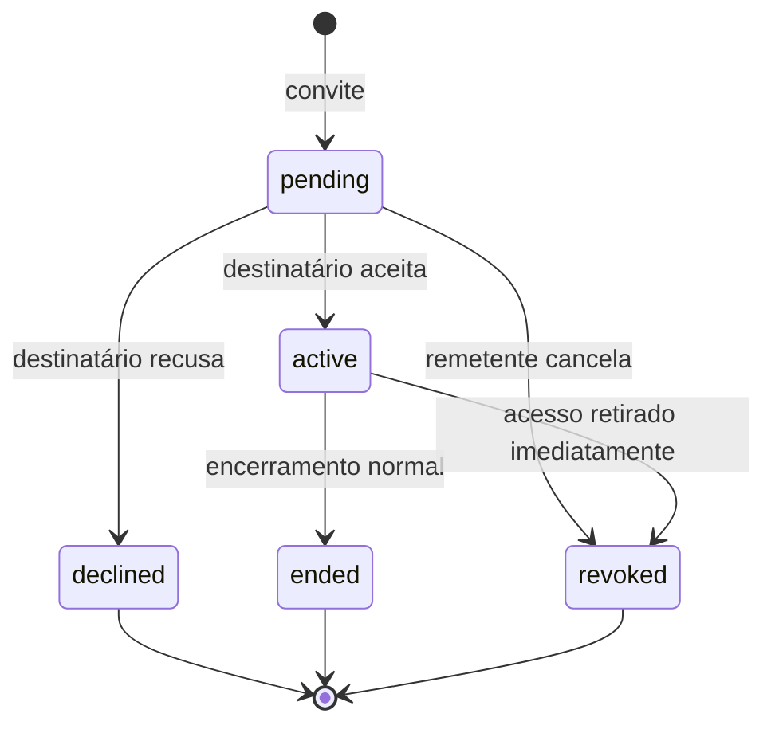

# Sprint 1.5 — Governança do ecossistema de personais

Data: 14 de julho de 2026
Status: desenho técnico; nenhuma migration criada/aplicada e nenhum deploy realizado.

## 1. Decisão executiva

`Meus Alunos` não deve ser implementado diretamente sobre `trainer_user_id -> student_user_id`.

A unidade profissional do produto será o **Trainer Workspace**:

```text
Trainer Workspace
├── membros profissionais
├── alunos e vínculos
├── templates e versões
├── assignments e versões
├── resultados autorizados
├── avaliações e comentários
├── consentimentos
└── Training Intelligence
```

O workspace é o tenant profissional. Ele possui ativos profissionais e organiza acesso; **não se torna dono dos dados do aluno**. `activities`, planos aceitos e histórico continuam pertencendo ao aluno.

A cadeia canônica será:



## 2. O que já existe e deve ser preservado

- `profiles` e a foundation local de `trainer_profiles` cuidam da identidade pública profissional.
- `workout_plans` é owner-only e já possui `plan_version`.
- `activities` já aponta para `workout_plan_id` e preserva nome, exercícios e versão em snapshots.
- Séries já distinguem planejada, concluída, pulada e adicionada, além de tipos de carga, RPE/RIR, descanso e notas.
- `personal_record_results`, highlights e estatísticas podem alimentar projeções autorizadas.
- Bloqueios e privacidade social continuam válidos, mas follow nunca concede acesso profissional.
- O documento `trainer-workout-sharing-import-architecture-2026-07-14.md` já define cópia owner-only, importação revisável e inteligência supervisionada.

O que faltava era uma camada explícita de tenancy, papéis profissionais, lifecycle do vínculo e separação entre permissão operacional, preferência de notificação e consentimento de IA.

## 3. Casos que o modelo precisa suportar

| Cenário | Comportamento recomendado |
|---|---|
| Aluno sem personal | Continua usando todos os treinos sociais normalmente; nenhuma linha profissional obrigatória |
| Aluno com um personal | Um relationship ativo, com escopo e permissões explícitas |
| Musculação + corrida | Dois relationships ativos, possivelmente em workspaces diferentes e com escopos diferentes |
| Personal com centenas de alunos | Lista paginada por cursor, RPC agregada e índices por workspace/status; nunca N+1 |
| Troca de personal | Relationship antigo termina; novo vínculo começa sem transferir acesso ou autoria automaticamente |
| Personal altera treino executado | Cria nova versão/proposta; atividades e versão aceita anterior não mudam |
| Aluno edita treino recebido | Alteração local não edita assignment; plano passa a divergente ou independente conforme escolha explícita |
| Treino importado | Plano pertence ao importador e mantém proveniência; não é tratado como prescrição profissional |
| Assessoria com equipe | Workspace possui owner, admins, trainers e assistentes com capacidades próprias |

## 4. Modelo de workspace

### 4.1 `trainer_workspaces`

Campos propostos:

- `id uuid primary key`;
- `owner_user_id uuid not null`;
- `name text not null`;
- `slug text null` — reservado para URL futura, sem necessidade no MVP;
- `status text`: `active`, `suspended`, `archived`;
- `timezone text`;
- `locale text`;
- `created_at`, `updated_at`, `archived_at`.

Regras:

- um personal individual recebe um workspace na primeira ativação das funções Coach;
- uma conta pode participar de vários workspaces no futuro;
- workspace não é público por padrão e não aparece como “academia” ou perfil social;
- arquivar bloqueia novas operações, mas preserva auditoria e versões;
- excluir conta segue a política de retenção/LGPD e nunca transfere student data ao workspace.

### 4.2 `trainer_workspace_members`

Campos:

- `workspace_id`, `user_id`;
- `role`: `owner`, `admin`, `trainer`, `assistant`, `viewer`;
- `status`: `invited`, `active`, `declined`, `revoked`;
- `capabilities jsonb` validado;
- `invited_by`, `accepted_at`, `revoked_at`, timestamps;
- PK/unique em `(workspace_id, user_id)`.

Capacidades iniciais:

- `manage_workspace`;
- `manage_members`;
- `manage_students`;
- `create_templates`;
- `assign_workouts`;
- `view_authorized_progress`;
- `comment_on_sessions`.

No MVP individual só existe o `owner`. A tabela evita uma migração estrutural quando surgirem assessorias e assistentes.

## 5. Vínculo workspace–aluno

### 5.1 `trainer_relationships`

Campos recomendados:

- `id uuid primary key`;
- `workspace_id uuid not null`;
- `primary_trainer_user_id uuid not null` — membro ativo responsável;
- `student_user_id uuid not null`;
- `service_scope text`: `strength`, `running`, `conditioning`, `mobility`, `general`;
- `status`: `pending`, `active`, `declined`, `ended`, `revoked`;
- `created_by uuid not null`;
- `invited_party`: `trainer` ou `student`;
- `started_at`, `accepted_at`, `ended_at`, `revoked_at`;
- `end_reason_code` estruturado;
- `created_at`, `updated_at`.

Não existe unicidade global por aluno. A restrição é um vínculo não encerrado para o mesmo `(workspace_id, student_user_id, service_scope)`. Assim o aluno pode ter corrida em um workspace e musculação em outro.

### 5.2 Máquina de estados



Um relacionamento encerrado nunca é reativado silenciosamente. Um retorno cria um novo vínculo e uma nova trilha de consentimento.

### 5.3 Permissões de acesso

Preferência: tabela 1:1 `trainer_relationship_permissions`, com colunas booleanas, em vez de JSONB solto:

- `relationship_id`;
- `can_assign_workouts`;
- `can_propose_workout_updates`;
- `can_view_workout_results`;
- `can_view_loads`;
- `can_view_effort`;
- `can_view_notes`;
- `can_view_progress`;
- `can_comment_on_sessions`;
- `granted_by_student_at`;
- `updated_at`.

Regras:

- o aluno controla todas as permissões de leitura;
- `can_view_loads`, `can_view_effort` e `can_view_notes` são independentes;
- comentar exige visibilidade da sessão;
- “editar treino” significa **propor nova versão**, nunca atualizar `workout_plans` do aluno;
- ausência de linha ou valor inválido equivale a `false`;
- mudanças entram em audit log append-only.

### 5.4 O que não deve ser permissão do relationship

- `can_receive_notifications`: é preferência de evento, não autorização de dados. Deve ficar em `trainer_relationship_notification_preferences` e ainda depende da permissão global de push do iOS.
- `can_use_data_for_ai`: exige consentimento separado, finalidade, política e revogação em `ai_training_consents`. Aceitar o personal ou um treino não autoriza IA.

## 6. Lifecycle e revogação

Ao encerrar/revogar:

- personal e workspace perdem imediatamente acesso a resultados, cargas, notas e progresso;
- assignments deixam de receber atualizações;
- o aluno mantém seus planos, activities, posts e PRs;
- templates continuam pertencendo ao workspace;
- assignment/version permanece para auditoria, mas não concede leitura de student data;
- caches por workspace/aluno devem ser invalidados;
- bloqueio bilateral encerra vínculos pendentes/ativos por RPC transacional;
- nenhum push ou deep link pode reabrir recurso revogado.

Não se recomenda apagar a relação para “limpar a lista”. Use estados e retenção definida.

## 7. Templates, assignments e versões

### 7.1 Separação de objetos

| Objeto | Dono | Mutabilidade | Finalidade |
|---|---|---|---|
| `trainer_workout_template` | workspace | identidade mutável | template reutilizável |
| `trainer_workout_template_version` | workspace | imutável após publicação | conteúdo profissional versionado |
| `trainer_workout_assignment` | workspace + relationship | lifecycle mutável | envio para um aluno |
| `trainer_workout_assignment_version` | assignment | imutável após envio | prescrição individual daquela versão |
| `workout_plan` aceito | aluno | editável pelo aluno | treino executável |
| `activity` | aluno | histórico owner-only | resultado real com snapshots |

### 7.2 Fluxo canônico

1. Workspace cria `ABC Hipertrofia` V1.
2. Personal cria um assignment para um relationship ativo.
3. A versão individual registra template/version de origem e ajustes do aluno.
4. Personal envia; a versão fica imutável.
5. Aluno aceita, recusa, ativa ou duplica como independente.
6. Aceitar cria um `workout_plan` owner-only do aluno por RPC.
7. Activities apontam para o plano do aluno e para assignment/version de origem.
8. Personal publica V2/V3; cada aluno permanece na própria versão até aceitar atualização.

### 7.3 Edição pelo aluno

O produto deve perguntar:

- `Manter vinculado e criar ajuste local`: preserva base/version e registra divergência estruturada;
- `Duplicar como treino independente`: remove atualização gerenciada, mantendo apenas proveniência.

Nunca reescrever o assignment. Nunca sobrescrever silenciosamente a edição do aluno ao aplicar nova versão.

Campos futuros no plano aceito:

- `source_type`;
- `source_workspace_id`;
- `source_assignment_id`;
- `source_assignment_version_id`;
- `management_mode`: `managed`, `locally_modified`, `detached`;
- `base_snapshot_hash`;
- `student_modified_at`.

## 8. Proveniência universal

Todo treino deve declarar origem sem perder o owner atual:

- `user_created`;
- `professional_template`;
- `professional_assignment`;
- `shared_copy`;
- `imported_text`;
- `imported_csv`;
- `imported_pdf`;
- `imported_image`;
- `imported_json`;
- `ai_draft_accepted`.

Proveniência não concede acesso. Um plano importado ou copiado pertence ao usuário que o salvou. IDs externos, fingerprints e fonte ficam separados de conteúdo social.

## 9. Resultados e dashboard

`activities` deve permanecer owner-only. RLS por linha não consegue ocultar seletivamente cargas/notas dentro do JSONB.

O dashboard usa projeções/RPCs:

- `get_workspace_students(workspace_id, cursor, filters)`;
- `get_trainer_student_summary(relationship_id, range)`;
- `get_trainer_student_sessions(relationship_id, cursor)`;
- `get_trainer_student_session(activity_id, relationship_id)`;
- `get_assignment_adherence(assignment_id, range)`.

Cada função revalida membership, relationship ativo, permissão, bloqueio e limite temporal. O retorno omite campos não autorizados; não envia `null` para indicar que um campo sensível existe.

Métricas futuras:

- planejados/concluídos e adesão;
- última execução;
- carga/reps e PR somente se autorizados;
- volume, duração e frequência;
- séries puladas e substituições;
- versão prescrita versus executada.

Escala:

- paginação por cursor;
- índices `(workspace_id, status, updated_at desc)` e `(student_user_id, status)`;
- agregação em lote, sem RPC por card;
- cache sempre escopado por workspace + usuário + permissões/version;
- revogação invalida cache imediatamente.

## 10. Training Intelligence

A camada de inteligência não lê diretamente tudo que o workspace consegue visualizar. Ela recebe apenas eventos elegíveis, consentidos e sanitizados.

### 10.1 Fontes estruturadas

- contexto do aluno: objetivo, experiência, frequência, tempo e equipamentos;
- template/version profissional;
- assignment/version individual;
- outcome derivado da activity;
- revisão do profissional;
- feedback do aluno;
- catálogo aprovado e suas versões.

### 10.2 Decisões profissionais como sinal

Registrar em `trainer_plan_revisions`:

- versão anterior e posterior;
- `maintained`, `exercise_replaced`, `volume_increased`, `volume_decreased`, `load_adjusted`, `frequency_changed`, `rest_adjusted`;
- motivo estruturado;
- contexto snapshot sanitizado;
- status de verificação profissional no momento;
- versão do catálogo/ruleset.

Correlação não é causalidade. “68% escolheram Upper/Lower” pode ser fator de ranking e explicação, nunca garantia de resultado ou prescrição médica.

### 10.3 Consentimento

`ai_training_consents` permanece separado por pessoa, finalidade e versão de política:

- templates profissionais;
- prescrições individuais;
- outcomes individuais;
- correções/feedback estruturados.

Excluir sempre nomes, mensagens, notas livres, localização precisa e conteúdo clínico. Revogação remove o item de futuras recuperações, avaliações e datasets conforme política operacional.

### 10.4 Estratégia

1. regras + recuperação de templates profissionais aprovados;
2. ranking supervisionado por contexto, adesão e correções;
3. geração restrita ao catálogo e validada por regras duras;
4. modelo próprio somente com escala, diversidade, governança e avaliação suficientes.

Todo resultado nasce como `ai_workout_draft`, mostra explicação e exige aceite humano. Limites do personal prevalecem sobre IA.

## 11. RLS e autorização

Matriz resumida:

| Recurso | Owner/admin | Trainer membro | Aluno | Terceiro |
|---|---|---|---|---|
| Workspace | gerencia conforme role | lê workspace ativo | não lê | não lê |
| Membership | gerencia conforme capability | lê próprios memberships | não lê | não lê |
| Relationship | gerencia convite conforme capability | lê vínculo atribuído | lê/responde/revoga o próprio | sem acesso |
| Permissões | não amplia leitura sozinho | somente consulta projeção | concede/revoga | sem acesso |
| Template | CRUD conforme capability | CRUD conforme capability | preview recebido | sem acesso |
| Assignment | cria/envia dentro do vínculo | cria/envia conforme capability | responde e lê o próprio | sem acesso |
| Workout plan aceito | sem acesso direto | sem acesso direto | owner CRUD | sem acesso |
| Activity | sem SELECT direto | sem SELECT direto | owner | sem acesso |
| Outcome | somente RPC autorizada | somente RPC autorizada | lê o próprio | sem acesso |
| Consentimento IA | sem alteração | altera apenas o próprio | altera apenas o próprio | sem acesso |

Regras técnicas:

- RLS habilitada em toda tabela `public`;
- mutations sensíveis por RPC transacional, não update livre;
- funções privilegiadas em schema privado, `security definer`, `search_path = ''`, com grants mínimos;
- helpers de membership usados com cuidado para evitar recursão de RLS;
- `service_role` nunca no cliente;
- nenhuma policy usa apenas `account_type = trainer` como autorização;
- bloqueios e status de conta são revalidados em cada operação;
- UPDATE exige SELECT correspondente;
- testes SQL com trainer, aluno, terceiro, anon, vínculo revogado e membro removido.

Referência: [Row Level Security do Supabase](https://supabase.com/docs/guides/database/postgres/row-level-security).

## 12. RPCs propostas

Workspace/membros:

- `create_my_trainer_workspace(name)`;
- `invite_workspace_member(workspace_id, user_id, role)`;
- `respond_workspace_invite(membership_id, accept)`;
- `revoke_workspace_member(membership_id)`.

Relationship:

- `invite_trainer_relationship(workspace_id, student_id, scope, permissions)`;
- `respond_trainer_relationship(relationship_id, accept, permissions)`;
- `update_trainer_relationship_permissions(relationship_id, permissions)`;
- `end_trainer_relationship(relationship_id, reason_code)`.

Assignment/versionamento:

- `create_trainer_template_version(...)`;
- `create_trainer_assignment_draft(relationship_id, template_version_id, ...)`;
- `send_trainer_assignment(assignment_id)`;
- `respond_trainer_assignment(assignment_version_id, decision)`;
- `apply_trainer_assignment_update(assignment_version_id)`;
- `detach_assigned_workout_plan(workout_plan_id)`.

Todas precisam de idempotency key para operações repetíveis/offline.

## 13. Audit log e observabilidade

Criar futuramente `trainer_governance_events`, append-only e sem grants de escrita direta:

- actor, workspace, relationship e entidade alvo;
- evento e reason code;
- versão anterior/posterior quando aplicável;
- timestamp, request/idempotency key;
- sem nota livre, carga ou mensagem sensível.

Eventos importantes:

- workspace/membro criado ou removido;
- convite aceito/recusado;
- permissão concedida/revogada;
- assignment enviado/aceito/recusado;
- versão aplicada/destacada;
- acesso negado por revogação/bloqueio;
- consentimento de IA concedido/revogado.

## 14. Ordem segura de implementação

### Sprint 1.5A — Workspace Foundation

- `trainer_workspaces` e `trainer_workspace_members`;
- workspace individual criado por RPC;
- roles/capabilities e RLS;
- sem tela `Meus Alunos` e sem assignment.

### Sprint 1.5B — Relationship & Consent

- `trainer_relationships`, permissions, notification preferences e audit events;
- convite, aceite, recusa, encerramento e bloqueio;
- telas mínimas de convite/consentimento;
- ainda sem acesso a `activities`.

### Sprint 2 — Meus Alunos

- lista paginada e detalhe de governança;
- mostra status, escopo e permissões;
- sem gráficos/resultados enquanto não houver assignment/outcome autorizado.

### Sprint 3 — Templates, Assignment & Versions

- template/version, assignment/version e cópia owner-only;
- aceite, atualização opt-in, detach e proveniência;
- activity recebe assignment/version.

### Sprint 4 — Outcomes & Progress

- projeções autorizadas, adesão e dashboard;
- activities continuam owner-only;
- comentários profissionais opcionais.

### Sprint 5 — Training Intelligence Fase 1

- consentimentos, qualidade, templates aprovados e recuperação por regras;
- nenhum ML próprio e nenhuma geração livre.

## 15. Gates antes de “Meus Alunos”

- workspace e membership têm definição canônica;
- relationship suporta múltiplos personais/escopos;
- aluno aceita e revoga;
- permissões de dados são independentes;
- notificação e consentimento de IA não são confundidos com acesso;
- bloqueio encerra acesso;
- RLS e RPCs têm matriz testada;
- paginação e índices suportam centenas de alunos;
- audit log registra mudanças de autoridade;
- nenhum SELECT direto de personal em `activities`;
- UI explica claramente o que será compartilhado.

## 16. Fora do escopo desta sprint

- criar migration;
- aplicar schema em produção;
- UI de `Meus Alunos`;
- envio real de treinos;
- dashboard;
- notificações novas;
- importação nova;
- ML, LLM, scanner ou câmera;
- alterações em Android, HealthKit/Strava ou SwiftUI.

## 17. Próximo prompt recomendado

> Vamos implementar a Sprint 1.5A — Workspace Foundation conforme `docs/trainer-ecosystem-governance-2026-07-14.md`. Primeiro revisar a migration local de Trainer Profiles e o estado do repositório. Criar migration aditiva apenas para `trainer_workspaces` e `trainer_workspace_members`, com roles/capabilities validadas, workspace individual por RPC idempotente, RLS e testes SQL para owner, member, terceiro e anon. Não criar `Meus Alunos`, relationship, assignment ou IA ainda. Não aplicar em produção, commitar ou publicar sem aprovação.
