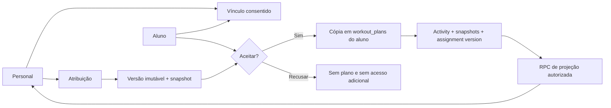
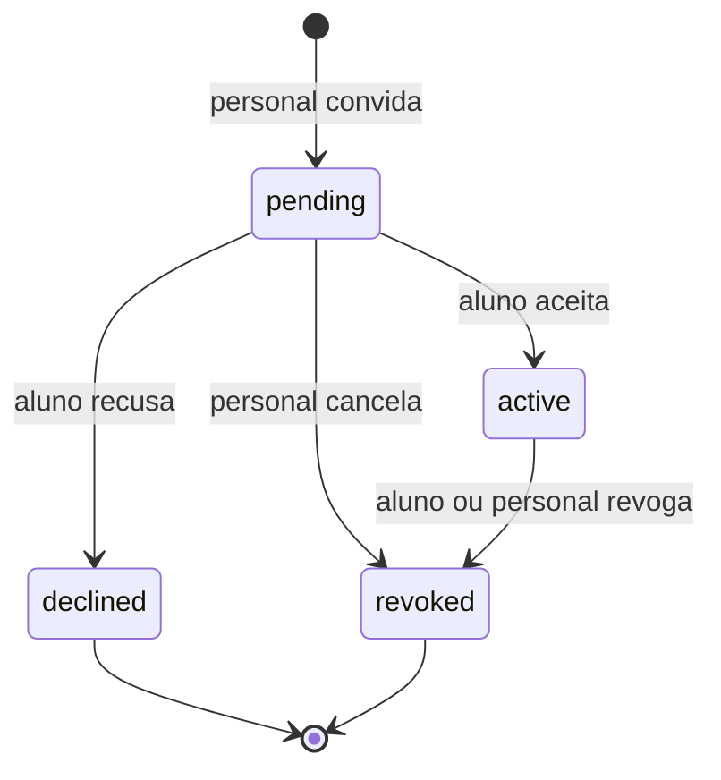
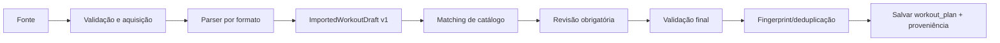

# Personal Trainer + compartilhamento e importação de treinos

Data: 14 de julho de 2026
Status: desenho técnico; nenhuma migration, alteração de produção ou publicação foi realizada.

> Adendo de governança: `docs/trainer-ecosystem-governance-2026-07-14.md`
> passa a ser a fonte canônica para tenancy, workspace e relacionamento.
> Onde este documento liga personal e aluno diretamente, deve-se ler
> `trainer_workspace -> trainer_relationship -> student`. Assignment,
> versionamento, importação e inteligência continuam válidos, agora sempre
> escopados ao workspace e ao vínculo consentido.

## 1. Resumo executivo

O Gym Circle já possui os blocos mais caros desta funcionalidade: identidade e perfis, relacionamentos sociais, mensagens, bloqueios, treinos salvos versionados, atividades com snapshots, séries semanticamente tipadas, catálogo de exercícios, importação inicial por PDF/imagem e notificações.

O que falta não deve ser resolvido abrindo os treinos e as atividades do aluno diretamente para o personal. A arquitetura recomendada separa seis conceitos:

1. **Vínculo consentido:** convite personal-aluno com permissões explícitas, revogáveis e negadas por padrão.
2. **Atribuição versionada:** o personal envia uma versão imutável; o aluno aceita e recebe uma cópia do treino que pertence a ele.
3. **Progresso projetado:** o personal acessa somente projeções autorizadas por RPC, nunca a linha completa de `activities`.
4. **Compartilhamento copiável:** um treino compartilhado é somente leitura; duplicar cria outro `workout_plan`, preservando autoria e proveniência.
5. **Importação revisável:** qualquer fonte vira `ImportedWorkoutDraft`; nada é salvo antes de o usuário revisar correspondências e avisos.
6. **Inteligência supervisionada:** templates profissionais consentidos, prescrições e resultados estruturados alimentam primeiro recuperação e ranking; qualquer geração permanece rascunho sujeito a revisão humana.

A ordem recomendada é compartilhar e duplicar primeiro, depois criar o vínculo, atribuição, importação universal e, por último, o painel de progresso. Essa sequência valida as primitivas de cópia, snapshot e autoria antes de introduzir acesso de terceiros a dados de treino.

## 2. Auditoria da base atual

### 2.1 O que já pode ser reaproveitado

| Área | Estado atual confirmado | Reutilização proposta |
|---|---|---|
| Identidade | `profiles` usa `auth.users` como identidade e já possui privacidade do perfil | Busca de personal/aluno, autoria e avatares |
| Relações sociais | `follows` possui solicitações para perfis privados | Descoberta social apenas; **não** deve conceder autorização de personal |
| Bloqueios | `user_blocks` e `private.has_block_between` bloqueiam interações bilaterais | Convite, aceite, atribuição, compartilhamento direto e comentários devem falhar se houver bloqueio |
| Mensagens | `conversations`, `conversation_participants`, `direct_messages` e RPC atômica de envio | Entrega opcional de cards de convite/treino; autorização continua nas novas tabelas |
| Treinos salvos | `workout_plans` é owner-only e armazena `exercises` em JSONB | Origem do treino, cópia para aluno e cópia de compartilhamento |
| Versionamento | `workout_plans.plan_version` cresce quando nome/exercícios mudam | Registrar a versão de origem enviada ou compartilhada |
| Histórico | `activities` possui `workout_plan_id`, nome/exercícios/versão em snapshot e origem | Preservar a execução mesmo depois de editar/remover o plano |
| Séries | `strength_sets` aceita `planned`, `completed`, `skipped`, `added` e tipos de carga | Conteúdo do treino atribuído e resultado autorizado |
| Notas/esforço | Atividade e séries já suportam nota, RPE, RIR e descanso | Exibir somente quando a respectiva permissão estiver ativa |
| Catálogo | Catálogo PT/EN, aliases, grupos, equipamento e governança comunitária | Correspondência e revisão de exercícios importados |
| Importação | PDF e imagem passam por extração/OCR local e parser de linhas | Primeiro adapter do pipeline universal |
| Deduplicação | `activities.external_id` deduplica atividades importadas | Não cobre importação de `workout_plans`; é necessária proveniência própria |
| Feed | Post de treino e compartilhamento visual/social já existem | Linkar um post a um plano copiável no futuro, sem transformar o post em fonte canônica |
| Push | Pipeline de notificações e APNs já existe | Novos eventos em sprint futura, sem implementação agora |

### 2.2 Evidências no repositório

- Núcleo social: `supabase/migrations/20260506193530_gym_circle_backend_core.sql`.
- Solicitações de follow: `supabase/migrations/20260507182800_gym_circle_follow_requests.sql`.
- Conversas: `supabase/migrations/20260507231405_instagram_direct_conversations.sql` e `20260507235137_atomic_direct_messages.sql`.
- Bloqueio/privacidade: `supabase/migrations/20260507215320_gym_circle_alpha_readiness.sql`.
- Atividades owner-only: `supabase/migrations/20260702180000_activities_foundation.sql`.
- Planos owner-only: `supabase/migrations/20260705230000_workout_plans.sql`.
- Vínculo e snapshot plano-atividade: `supabase/migrations/20260713134713_link_activities_to_workout_plans.sql`.
- Semântica e dados avançados das séries: `20260713134715_add_workout_set_semantics.sql` e `20260713134716_add_workout_effort_notes_rest.sql`.
- Catálogo: `20260706193000_workout_catalog.sql` e `20260713145759_add_workout_pr_highlights_catalog_governance.sql`.
- Importação atual: `apps/web/src/components/gym-circle/workout/workoutPlanImport.ts`, `workoutPlanParser.ts` e `WorkoutPlansFab.tsx`.

### 2.3 Lacunas reais

- Não existem tabelas de vínculo personal-aluno, atribuição, versões de atribuição ou comentários de acompanhamento.
- Não existe compartilhamento de plano com token revogável, proveniência e duplicação transacional.
- A atividade não guarda a atribuição e a versão que a originaram.
- As políticas atuais de `activities` e `workout_plans` são owner-only; isso é correto e deve continuar assim.
- O compartilhamento social atual envia uma publicação/arte por mensagem, não um plano copiável.
- A importação por arquivo aceita PDF e imagem; texto livre, CSV e JSON Gym Circle ainda não têm fluxo dedicado.
- O parser atual encontra exercícios por nome, mas não produz confiança, avisos estruturados ou uma etapa formal de resolução.
- Itens desconhecidos podem ser oferecidos ao catálogo comunitário; importação não deve publicar no catálogo sem consentimento separado e explícito.
- Não há deduplicação de planos importados nem registro de fonte no `workout_plan`.

## 3. Arquitetura proposta



Princípios:

- **Consentimento antes do acesso.** Follow, mensagem ou perfil público não equivalem a vínculo profissional.
- **Dono do dado continua sendo o aluno.** O personal não edita diretamente `workout_plans` nem `activities` do aluno.
- **Snapshot é obrigatório.** Atribuições e compartilhamentos preservam o conteúdo como enviado.
- **Atualização é proposta, não mutação remota.** Uma nova versão depende de aceite do aluno.
- **Negar por padrão.** Permissões ausentes ou inválidas significam `false`.
- **Revogação é imediata.** O histórico continua com o aluno; o acesso do personal termina na mesma transação.
- **Dados sensíveis saem por projeções.** Carga, notas e resultados são liberados separadamente.

## 4. Modelo de vínculo personal-aluno

### 4.1 `trainer_client_relationships`

| Campo | Tipo sugerido | Regra |
|---|---|---|
| `id` | uuid | PK |
| `trainer_user_id` | uuid | FK `auth.users`; diferente do aluno |
| `client_user_id` | uuid | FK `auth.users` |
| `status` | text | `pending`, `active`, `declined`, `revoked` |
| `permissions` | jsonb | Objeto validado, chaves conhecidas e booleanas |
| `invited_by` | uuid | No MVP deve ser o personal; prepara convite reverso futuro |
| `created_at` | timestamptz | criação do convite |
| `accepted_at` | timestamptz | preenchido somente ao ativar |
| `declined_at` | timestamptz | recomendado para auditoria |
| `revoked_at` | timestamptz | preenchido por qualquer participante |
| `updated_at` | timestamptz | mudança de status/permissão |

Índices futuros:

- parcial único em `(trainer_user_id, client_user_id)` onde `status in ('pending','active')`;
- `(trainer_user_id, status, updated_at desc)`;
- `(client_user_id, status, updated_at desc)`.

O índice parcial permite manter convites recusados/revogados como histórico e criar um novo convite depois. Não se recomenda reativar silenciosamente uma linha antiga.

### 4.2 Permissões

Contrato inicial:

```json
{
  "can_assign_workouts": true,
  "can_view_workout_results": false,
  "can_view_loads": false,
  "can_view_notes": false,
  "can_comment_on_sessions": false
}
```

Regras:

- `can_assign_workouts` pode vir ligado no convite porque é o objetivo do vínculo.
- Todas as permissões de leitura devem ser apresentadas ao aluno antes do aceite e começar desligadas, salvo escolha explícita.
- Somente o aluno altera permissões de leitura.
- `can_view_loads` não implica acesso a notas.
- `can_view_notes` não inclui mensagens privadas ou notas fora do treino atribuído.
- `can_comment_on_sessions` exige `can_view_workout_results`.
- JSONB deve ter constraint/função validadora: sem chaves desconhecidas, sem valores não booleanos e com tamanho limitado.

Se o produto precisar consultar permissões frequentemente, uma evolução futura pode migrá-las para colunas booleanas. No MVP, JSONB validado mantém flexibilidade sem enfraquecer a autorização.

### 4.3 Máquina de estados



Todas as transições devem passar por RPCs transacionais, não por `update` livre do cliente:

- `invite_trainer_client(p_client_user_id, p_permissions)`;
- `respond_trainer_invite(p_relationship_id, p_accept, p_permissions)`;
- `update_trainer_permissions(p_relationship_id, p_permissions)` — aluno;
- `revoke_trainer_client_relationship(p_relationship_id)` — qualquer participante.

Cada RPC verifica sessão autenticada, papel na relação, conta ativa, ausência de bloqueio bilateral e transição permitida.

### 4.4 Comportamento de revogação e bloqueio

- Revogar não apaga planos, atividades ou resultados do aluno.
- A partir da revogação, todas as RPCs do personal retornam acesso negado ou lista vazia.
- Bloquear um participante deve revogar relações `pending` e `active` de forma transacional.
- Um novo convite exige remover o bloqueio e uma nova ação explícita; nunca reativar automaticamente.

## 5. Treinos atribuídos e versionamento

Uma tabela única com conteúdo mutável não preserva adequadamente versões aceitas. Recomenda-se separar identidade/lifecycle da atribuição e conteúdo imutável.

### 5.1 `trainer_workout_assignments`

| Campo | Uso |
|---|---|
| `id` | identidade da atribuição |
| `relationship_id` | vínculo ativo que autorizou o envio |
| `trainer_user_id`, `client_user_id` | redundância controlada para índices e validação |
| `source_workout_plan_id` | plano do personal; nullable com `on delete set null` |
| `assigned_workout_plan_id` | cópia atual pertencente ao aluno |
| `current_version_id` | versão mais recente enviada |
| `accepted_version_id` | versão aceita/ativa pelo aluno |
| `status` | `draft`, `sent`, `accepted`, `declined`, `active`, `completed`, `archived` |
| `start_date`, `end_date` | janela opcional |
| `frequency_per_week` | sugestão, não prescrição |
| timestamps | criação, envio, aceite, conclusão, arquivamento |

### 5.2 `trainer_workout_assignment_versions`

| Campo | Uso |
|---|---|
| `id`, `assignment_id` | identidade e pai |
| `version` | crescente e único por atribuição |
| `title`, `instructions` | texto daquela versão |
| `source_workout_plan_id` | referência opcional |
| `source_plan_version` | versão do plano no momento do envio |
| `plan_snapshot` | nome, exercícios, séries, cargas sugeridas, descanso e notas |
| `created_by` | personal autor |
| `created_at`, `sent_at` | auditoria |

Uma versão enviada é imutável. Corrigir conteúdo cria a próxima versão.

### 5.3 Fluxo de aceite e atualização

1. Personal cria rascunho a partir de um plano ou do zero.
2. `send_trainer_workout_assignment` materializa e trava a versão.
3. Aluno visualiza conteúdo e dados que poderão ser compartilhados.
4. Ao aceitar, uma RPC cria um `workout_plans` com `user_id = client_user_id` e copia o snapshot.
5. `assigned_workout_plan_id` aponta para essa cópia do aluno.
6. A edição do plano original do personal não afeta a cópia nem atividades antigas.
7. Uma atualização do personal cria V2. O aluno escolhe “Aplicar atualização” ou mantém V1.
8. Aplicar V2 cria uma nova revisão/cópia do aluno; não reescreve atividades anteriores.

“Duplicar” cria um plano independente, sem atualização gerenciada, mas mantém proveniência. “Ativar” fixa o plano aceito na área do aluno; não concede edição direta ao personal.

### 5.4 Vínculo da execução à atribuição

Para medir adesão sem ambiguidade, uma migration futura deve adicionar a `activities`:

- `trainer_workout_assignment_id uuid null`;
- `trainer_assignment_version_id uuid null`.

`workout_plan_id` continua apontando para o plano do aluno. Os dois novos campos identificam a prescrição/versão, e os snapshots existentes preservam o conteúdo executado.

### 5.5 Comentários do personal

Não permitir que o personal edite notas ou atividades do aluno. Criar `trainer_session_comments`:

- `id`, `relationship_id`, `assignment_id`, `activity_id`;
- `author_user_id`, `client_user_id`, `body`;
- `created_at`, `edited_at`, `deleted_at`.

Somente participantes do vínculo ativo veem comentários; escrever exige `can_comment_on_sessions`. O aluno pode ocultar/remover o acesso revogando a permissão ou o vínculo, sem alterar o registro do treino.

## 6. Experiência do personal

### 6.1 Meus alunos

- abas `Ativos`, `Convites` e `Encerrados`;
- busca de usuário respeitando bloqueio e conta ativa;
- card com permissões resumidas e última atividade **somente se autorizada**;
- CTA `Convidar aluno`.

### 6.2 Detalhe do aluno

- status e permissões;
- treinos enviados e estado de cada um;
- adesão agregada autorizada;
- sessões recentes autorizadas;
- CTA `Criar treino` e `Enviar treino existente`;
- estado explícito “O aluno não compartilhou cargas/notas”.

### 6.3 Editor MVP

- exercícios do catálogo;
- séries, reps ou duração;
- tipo de carga e carga sugerida opcional;
- descanso alvo;
- nota/instrução por exercício;
- título, instrução geral, período e frequência sugerida;
- prévia exata do que o aluno receberá.

### 6.4 Acompanhamento

- aceitou/recusou/ativou;
- sessões concluídas e taxa de adesão se permitidas;
- carga somente com `can_view_loads`;
- notas somente com `can_view_notes`;
- comentário somente com `can_comment_on_sessions`.

## 7. Experiência do aluno

### 7.1 Meu personal

- identidade do personal e início do vínculo;
- permissões em linguagem clara, com toggles controlados pelo aluno;
- histórico de convites;
- CTA destrutivo `Revogar acesso` com explicação do efeito imediato.

### 7.2 Treinos enviados

Estados visuais: novo, aceito, atualização disponível, recusado, concluído e arquivado.

Na revisão do treino:

- quem enviou e quando;
- exercícios, séries, carga sugerida, descanso e notas;
- quais resultados serão compartilhados;
- `Aceitar e adicionar aos meus treinos`;
- `Duplicar como treino independente` quando permitido;
- `Recusar`;
- nenhuma execução automática ou aceite implícito.

### 7.3 Execução

O aluno usa a mesma tela de treino atual. A atividade continua pertencendo ao aluno; a origem/versão é registrada silenciosamente. No pós-treino, uma nota curta informa quais dados serão visíveis ao personal e permite revisar permissões.

## 8. Compartilhamento e duplicação entre usuários

### 8.1 Modelo proposto

`workout_plan_shares`:

- `id`, `owner_user_id`, `workout_plan_id`;
- `recipient_user_id` opcional para envio direto;
- `share_kind`: `direct` ou `link`;
- `token_hash` opcional — nunca armazenar token em claro;
- `plan_version`, `plan_snapshot`;
- `allow_duplicate`, `expires_at`, `max_uses`, `use_count`;
- `revoked_at`, `created_at`, `last_used_at`.

`workout_plan_provenance` ou campos equivalentes na cópia:

- `workout_plan_id` da cópia;
- `source_workout_plan_id` nullable;
- `source_author_user_id`;
- `source_share_id`;
- `source_plan_version`;
- `import_source`/`created_via`;
- `created_at`.

### 8.2 Regras

- Visualizar nunca concede edição do original.
- Duplicar cria uma nova linha owner-only em `workout_plans`.
- A cópia preserva “Criado originalmente por …”, mas o novo dono pode editá-la.
- Alterações futuras no original não propagam para cópias comuns.
- O autor pode revogar o link; cópias já criadas permanecem com o destinatário.
- Compartilhamento direto exige usuário autenticado e falha se houver bloqueio bilateral.
- MVP de link deve exigir login para reduzir scraping/abuso. Link público anônimo pode ser avaliado depois.
- Token: 256 bits aleatórios, mostrado uma única vez, armazenado apenas como SHA-256, com expiração e revogação.
- Resolver token deve ocorrer por RPC/Edge Function com rate limit; a Data API não expõe `token_hash`.

### 8.3 RPCs futuras

- `create_workout_plan_share(plan_id, recipient_id, expires_at, allow_duplicate)`;
- `revoke_workout_plan_share(share_id)`;
- `get_shared_workout_preview(share_id ou token)`;
- `duplicate_shared_workout(share_id ou token)` — transacional e idempotente.

## 9. Importação universal

### 9.1 Estado atual

O fluxo existente:

1. aceita PDF ou imagem de até 25 MB;
2. extrai texto de PDF e usa OCR Tesseract em páginas escaneadas/imagens;
3. normaliza fotos e tenta remover linhas de tabela;
4. reconhece português/inglês;
5. interpreta linhas como nome, séries, reps, duração/falha e técnica;
6. tenta casar com catálogo e abre o editor antes de salvar.

Ele já atende parte de PDF/imagem, mas não é um pipeline universal: não há draft versionado, confiança por campo, avisos estruturados, deduplicação de plano ou adapters de texto/CSV/JSON.

### 9.2 Pipeline recomendado



### 9.3 `ImportedWorkoutDraft`

```ts
type ImportedWorkoutDraft = {
  schemaVersion: 1;
  name: string;
  source: {
    kind: "text" | "csv" | "pdf" | "image" | "gym_circle_json" | "provider";
    provider?: string;
    fileName?: string;
    externalId?: string;
    fingerprint?: string;
  };
  exercises: Array<{
    sourceName: string;
    matchedExerciseId: string | null;
    matchConfidence: number;
    matchMethod: "id" | "exact" | "alias" | "fuzzy" | "manual" | "none";
    sets: Array<{
      reps?: number;
      durationSeconds?: number;
      weightKg?: number;
      loadType?: "external" | "bodyweight" | "assisted" | "not_provided";
      restSeconds?: number;
    }>;
    notes?: string;
    warnings: string[];
  }>;
  warnings: string[];
};
```

### 9.4 Adapters MVP

- **Texto livre:** reutiliza `parseWorkoutPlanText`; textarea e revisão.
- **CSV:** mapeamento de colunas com prévia; delimitador/encoding detectados; nenhum CSV é salvo automaticamente.
- **PDF:** reaproveita extração atual, adicionando confiança e avisos.
- **Imagem/OCR:** reaproveita normalização/Tesseract, sempre destacando baixa confiança.
- **JSON Gym Circle:** schema versionado, limites de tamanho/quantidade e validação estrita.

### 9.5 Fontes futuras

Hevy, Strong e Jefit devem entrar por adapters de **exportação oficial** ou API autorizada. Não fazer scraping, não reutilizar marca/assets e não afirmar compatibilidade antes de validar exemplos reais e termos de uso. Apple Health/Health Connect importam atividades, não substituem necessariamente o formato de plano.

### 9.6 Matching e revisão

Ordem de correspondência:

1. ID Gym Circle válido no JSON;
2. nome exato no idioma;
3. alias aprovado;
4. similaridade normalizada + equipamento/grupo muscular;
5. escolha manual.

Regras:

- confiança abaixo do limiar nunca é aceita silenciosamente;
- itens não reconhecidos aparecem no topo da revisão;
- o usuário pode manter exercício local sem publicá-lo no catálogo;
- enviar exercício ao catálogo comunitário exige uma confirmação independente;
- “Salvar” fica desabilitado somente para erros estruturais, não para avisos revisáveis;
- o usuário vê a fonte e pode corrigir cada campo.

### 9.7 Deduplicação e privacidade

- Calcular fingerprint de conteúdo canonicalizado por usuário/fonte.
- Oferecer `Abrir existente`, `Duplicar mesmo assim` ou `Atualizar rascunho`; não sobrescrever plano automaticamente.
- `activities.external_id` não deve ser reutilizado para planos.
- PDFs/imagens não são persistidos por padrão; processamento local atual é positivo para privacidade.
- Se OCR/backend futuro for necessário, usar upload temporário, expiração curta e deleção após parsing.
- Validar tamanho, MIME e magic bytes; limitar páginas, exercícios e sets; tratar PDF malformado/zip bomb.
- Sanitizar conteúdo em exportação CSV para evitar fórmula executável.

## 10. Trainer-Supervised Workout Intelligence

### 10.1 Objetivo e limite desta camada

`Trainer-Supervised Workout Intelligence` é uma camada de dados, consentimento, avaliação e feedback para melhorar recomendações de treino progressivamente. Ela não significa treinar um modelo próprio agora.

O primeiro produto deve combinar regras determinísticas e recuperação de templates profissionais aprovados. Somente depois de acumular dados elegíveis, consistentes e consentidos entram ranking contextual e geração restrita.

Princípios:

- o sistema aprende com decisões humanas estruturadas, não com qualquer treino encontrado no banco;
- autoria, origem, versão e consentimento acompanham cada exemplo elegível;
- template profissional não é a mesma coisa que prescrição individual;
- plano de usuário comum não é presumido como exemplo profissional;
- treino de IA nunca nasce como plano ativo: nasce como `ai_workout_draft`;
- aceitar, editar ou rejeitar gera feedback; não gera autorização retroativa para treinamento;
- notas livres, mensagens, nomes e dados sensíveis ficam fora do dataset.

### 10.2 Separação obrigatória de origens

| Origem | Entidade canônica | Quem cria | Pode ser reutilizada? | Uso em inteligência |
|---|---|---|---|---|
| Template profissional | `trainer_workout_templates` | personal verificado | sim, dentro do escopo declarado | somente com opt-in profissional e qualidade aprovada |
| Prescrição individual | `trainer_workout_assignments` + versão | personal para um aluno | não como template sem transformação/revisão | contexto individual exige opt-in separado do aluno e do profissional |
| Treino de usuário comum | `workout_plans` com proveniência `user_created` | usuário | somente por compartilhamento explícito | excluído por padrão do corpus profissional |
| Treino gerado por IA | `ai_workout_drafts` | sistema, a pedido de usuário/personal | somente após aceite e conversão | nunca vira ground truth apenas por ter sido gerado |

Campos de origem devem usar enum/check fechado, por exemplo:

- `professional_template`;
- `professional_individual`;
- `user_created`;
- `imported`;
- `shared_copy`;
- `ai_draft`;
- `ai_accepted`.

Uma cópia aceita preserva a origem anterior e acrescenta o evento de transformação. Não sobrescrever autoria profissional com “IA” nem apresentar conteúdo gerado como aprovado por um personal.

### 10.3 Contexto estruturado

O contexto usado para recuperar/rankear um treino deve ser um snapshot versionado, com campos limitados e sem texto clínico:

```ts
type WorkoutIntelligenceContext = {
  schemaVersion: 1;
  objective: "strength" | "hypertrophy" | "conditioning" | "general_fitness" | "mobility";
  experienceLevel: "beginner" | "intermediate" | "advanced";
  frequencyPerWeek: number;
  availableDurationMinutes: number;
  availableEquipmentIds: string[];
  preferredExerciseIds?: string[];
  avoidedExerciseIds?: string[];
  preferenceTags?: string[];
  nonMedicalRestrictionTags?: string[];
};
```

Regras:

- duração, frequência e listas têm limites de tamanho;
- equipamentos usam IDs/taxonomia controlada;
- restrições são apenas operacionais e não médicas, como `sem saltos`, `sem barra` ou `treino em casa`;
- texto que indique lesão, doença, gestação de risco, dor persistente ou diagnóstico não entra nesse contexto e interrompe a geração automática;
- contexto individual é snapshot da atribuição/draft, não atributo global eterno do usuário;
- a explicação mostra quais campos influenciaram a sugestão.

### 10.4 Captura estruturada da prescrição

O snapshot de template, atribuição e draft usa o catálogo oficial e registra:

- exercícios e IDs de catálogo;
- ordem;
- séries;
- faixa ou alvo de reps;
- duração, quando aplicável;
- carga sugerida opcional;
- `load_type`;
- descanso alvo;
- RPE/RIR alvo opcional;
- frequência semanal;
- regra de progressão estruturada;
- limites definidos pelo profissional.

Progressão não deve ser apenas texto livre. Contrato inicial:

```ts
type ProgressionRule = {
  kind: "none" | "double_progression" | "reps_then_load" | "professional_review";
  minSuccessfulSessions?: number;
  repRangeMin?: number;
  repRangeMax?: number;
  loadIncrementPercentMax?: number;
  loadIncrementKgMax?: number;
  rpeCeiling?: number;
  rirFloor?: number;
};
```

O profissional pode usar instrução adicional para o aluno, mas texto livre não participa do treinamento por padrão.

### 10.5 Captura estruturada do resultado

`workout_assignment_outcomes` representa uma projeção sanitizada da atividade, não uma segunda fonte editável do treino. Ela guarda:

- atribuição e versão executadas;
- activity de origem;
- adesão e taxa de conclusão;
- séries planejadas, concluídas, puladas e adicionadas;
- reps, cargas e tipos de carga reais, quando consentidos;
- duração real;
- RPE/RIR agregados ou por set, quando consentidos;
- progressão em relação à execução anterior;
- exercícios substituídos e seus IDs de catálogo;
- versão da lógica que derivou o outcome;
- `eligible_for_ai` calculado no backend, nunca informado pelo cliente.

Notas livres não são copiadas. Para pesquisa/avaliação, preferir agregados e eventos estruturados, como `exercise_substituted` e `set_skipped`, sem nome do usuário.

### 10.6 Captura de revisão profissional

`trainer_plan_revisions` registra o que o profissional decidiu após observar resultados:

- `maintained`;
- `exercise_replaced`;
- `volume_increased`;
- `volume_decreased`;
- `load_adjusted`;
- `frequency_changed`;
- `rest_adjusted`;
- `progression_rule_changed`.

Cada revisão aponta para a versão anterior e posterior, possui diff estruturado e `reason_code` controlado:

- `goal_progression`;
- `adherence_low`;
- `effort_too_low`;
- `effort_too_high`;
- `equipment_unavailable`;
- `exercise_preference`;
- `schedule_change`;
- `technique_adjustment`;
- `professional_judgment`.

Uma explicação livre pode existir para a relação personal-aluno, mas é excluída do corpus por padrão. A revisão deve registrar também `reviewer_verification_snapshot`, versão do catálogo e timestamp.

### 10.7 Tabelas propostas

#### `trainer_workout_templates`

- `id`, `trainer_user_id`, `name`, `description`;
- `status`: `draft`, `published`, `archived`, `suspended`;
- `version`, `schema_version`;
- elegibilidade contextual: objetivo, experiência, frequência e duração mínima/máxima;
- equipamentos e tags estruturadas;
- `plan_snapshot` validado;
- `source_workout_plan_id` e `source_plan_version` opcionais;
- `quality_status`: `pending`, `approved`, `rejected`, `flagged`;
- `professional_verification_snapshot`;
- `created_at`, `published_at`, `updated_at`, `archived_at`.

O template é reutilizável e não contém nome, perfil, resultado ou nota de aluno.

#### `trainer_workout_assignments`

Mantém o modelo da seção 5 e acrescenta:

- `source_type`;
- `trainer_workout_template_id` e versão de origem;
- `context_snapshot`;
- `prescription_snapshot`/versão;
- limites profissionais de progressão;
- `ai_draft_id` opcional quando o personal aprovou um rascunho;
- `created_by_kind`: `trainer` ou `ai_assisted_trainer`.

Um assignment com auxílio de IA continua tendo o personal como responsável somente após revisão e envio explícitos.

#### `workout_assignment_outcomes`

- `id`, `assignment_id`, `assignment_version_id`, `activity_id` único;
- `client_user_id`, `trainer_user_id`;
- métricas estruturadas de adesão, duração, séries e substituições;
- `load_metrics` e `effort_metrics` sanitizados e opcionais;
- `derivation_version`, `derived_at`;
- `quality_status`, `quality_reason_codes`;
- `ai_eligibility_checked_at`.

#### `trainer_plan_revisions`

- `id`, `assignment_id`, `trainer_user_id`;
- `from_version_id`, `to_version_id`;
- `revision_kind`, `reason_code`;
- `structured_diff`;
- `reviewer_verification_snapshot`;
- `created_at`.

`structured_diff` só aceita operações e campos conhecidos. Não armazenar patch arbitrário executável.

#### `ai_training_consents`

- `id`, `user_id`;
- `subject_role`: `trainer` ou `client`;
- `scope`: `professional_templates`, `individual_prescriptions`, `individual_outcomes`, `structured_feedback`;
- `status`: `granted`, `revoked`, `expired`;
- `policy_version`, `consent_text_version`;
- `granted_at`, `revoked_at`, `expires_at`;
- `collection_source`, `receipt_hash`;
- unique parcial para um consentimento ativo por usuário/escopo/versão.

Consentimentos do personal e do aluno são independentes. Consentir com templates não autoriza uso de prescrições individuais. Aceitar um treino não equivale a consentir com IA.

#### `ai_workout_feedback`

- `id`, `ai_workout_draft_id`, `reviewer_user_id`;
- `reviewer_role`: `trainer` ou `user`;
- `action`: `accepted`, `edited`, `rejected`, `saved`, `assigned`;
- `reason_codes` estruturados;
- `structured_diff` entre draft e versão aceita;
- `created_at`;
- texto livre opcional separado e `eligible_for_ai = false` por padrão.

#### `ai_workout_drafts`

- `id`, `requested_by_user_id`, `reviewer_trainer_user_id` opcional;
- `generation_mode`: `rules`, `retrieval`, `ranked_retrieval`, `constrained_generation`;
- `context_snapshot` sanitizado;
- IDs/versões dos templates recuperados;
- `catalog_version`, `ruleset_version`, `ranker_version`, `model_version` opcional;
- `draft_snapshot`;
- `explanation_factors`;
- `guardrail_results`;
- `status`: `generated`, `under_review`, `accepted`, `edited`, `rejected`, `expired`;
- `accepted_workout_plan_id` ou `accepted_assignment_id`;
- `created_at`, `reviewed_at`, `expires_at`.

Draft expirado não deve continuar executável sem nova validação de catálogo, equipamentos, consentimento e regras.

#### Dependências auxiliares

- Uma fonte confiável de profissionais verificados, como `trainer_verifications`, gerida fora do cliente. Não usar `user_metadata` editável como credencial.
- Um manifest privado de dataset/modelo para linhagem futura: versões de política, regras, catálogo, IDs pseudonimizados elegíveis, data de extração e exclusões.
- Uma view privada de elegibilidade ou job backend; nenhuma tabela de treinamento é exposta diretamente ao app.

### 10.8 Consentimento, anonimização e revogação

Fluxo de consentimento:

1. explicar separadamente uso do template profissional e uso de dados individuais;
2. mostrar finalidade, campos incluídos/excluídos, prazo e versão da política;
3. registrar opt-in afirmativo; caixa pré-marcada não é aceita;
4. permitir revogar por escopo;
5. revalidar consentimento no momento de compor qualquer dataset;
6. registrar qual versão da política e do pipeline autorizou cada exemplo.

Dados excluídos do corpus:

- nome, username, avatar, e-mail e localização precisa;
- mensagens, comentários sociais e conversas;
- notas livres do aluno/personal;
- conteúdo que indique diagnóstico, dor, lesão ou condição de saúde;
- IDs públicos diretamente reversíveis;
- arquivos PDF/imagem originais, salvo consentimento/finalidade específicos.

Pseudonimização não é anonimização completa. Para fases 1–3, revogar remove imediatamente o conteúdo de recuperação, ranking e futuras avaliações. Antes da Fase 4, deve existir política operacional de retirada de datasets, manifests, checkpoints e próximo ciclo de retreinamento; não prometer “desaprender instantaneamente” um modelo já treinado.

### 10.9 Qualidade e elegibilidade

Um item só é elegível quando todas as condições forem verdadeiras:

- consentimento ativo para o escopo e política vigentes;
- autoria/origem conhecidas;
- profissional verificado quando o item se apresenta como profissional;
- catálogo e schema válidos;
- dados mínimos completos;
- sem denúncia, suspensão, bloqueio de qualidade ou inconsistência;
- outcome ligado à atribuição e activity corretas;
- nenhum campo sensível proibido presente;
- revisão automática e, quando necessário, editorial concluída.

Peso de qualidade:

- verificação profissional e histórico de revisões aumentam confiança;
- adesão/resultado ajudam no ranking, mas não provam segurança ou causalidade;
- quantidade de treinos não supera violações de regra;
- treinos de usuário comum e drafts de IA não entram como verdade profissional;
- rascunho aceito com grandes edições deve ensinar a correção, não reforçar o draft original.

### 10.10 Human-in-the-loop

Todo fluxo começa em `ai_workout_drafts`:

1. usuário ou personal informa contexto;
2. sistema recupera/ordena ou gera dentro dos limites;
3. interface mostra “Rascunho sugerido”, origem e explicação;
4. humano aceita, edita ou rejeita;
5. somente após aceite uma RPC cria `workout_plan` ou versão de assignment;
6. o diff e feedback estruturados são registrados;
7. usar esse feedback para inteligência exige consentimento próprio.

Explicações mínimas:

- “Compatível com os equipamentos selecionados”;
- “Baseado em template profissional aprovado”;
- “Cabe nos 45 minutos informados”;
- “Evita exercícios marcados por você”;
- “Mantém limites definidos pelo seu personal”.

Nunca usar explicações clínicas ou certezas como “ideal”, “seguro para sua lesão” ou “vai garantir resultado”.

### 10.11 Guardrails

- Não diagnosticar, tratar ou prescrever condição médica.
- Interromper e orientar busca de profissional quando o pedido depender de informação clínica.
- Só usar `exercise_id` existente e aprovado no catálogo/versão registrada.
- Interseccionar equipamentos requeridos com equipamentos disponíveis.
- Respeitar duração, frequência, preferências e restrições estruturadas.
- Limites do personal têm precedência sobre ranking/modelo.
- Não sugerir progressão agressiva sem histórico suficiente e regra profissional explícita.
- Não aumentar simultaneamente carga, volume e frequência como atalho automático.
- Não criar PR, carga alvo ou RPE fictícios.
- Validar novamente o draft no servidor antes de converter em plano/assignment.
- Bloquear geração/publicação quando regras falharem; não apenas mostrar warning.

### 10.12 Avaliação

Métricas offline obrigatórias:

- 100% dos exercícios pertencem ao catálogo aprovado;
- 100% dos equipamentos requeridos estão disponíveis;
- 100% das regras e limites profissionais são respeitados;
- taxa de violações médicas/guardrails deve ser zero no conjunto de testes;
- precisão do matching de contexto;
- cobertura e diversidade sem repetir sempre o mesmo template;
- edit distance entre draft e versão aprovada;
- desempenho por nível de experiência, objetivo e disponibilidade de equipamento.

Métricas de produto:

- taxa de visualização, aceite, edição e rejeição;
- motivos de rejeição;
- conclusão e substituição do treino aceito;
- satisfação explícita;
- taxa de escalonamento para personal;
- denúncias/incidentes, com capacidade de desligar rapidamente uma versão.

Não otimizar apenas adesão, volume ou aumento de carga. Essas métricas podem incentivar recomendações ruins se usadas sem guardrails e revisão profissional.

### 10.13 Estratégia em quatro fases

#### Fase 1 — Regras + recuperação

- usa templates profissionais aprovados e consentidos;
- filtra objetivo, experiência, tempo e equipamento;
- ordenação determinística e explicável;
- personal/usuário revisa e aceita;
- sem geração livre e sem modelo próprio.

Gate de saída: catálogo consistente, consentimento auditável, RLS validada e taxa de violação de constraints igual a zero.

#### Fase 2 — Ranking supervisionado

- aprende a ordenar candidatos por contexto, adesão, resultado e correções;
- apenas templates já válidos entram como candidatos;
- avaliação offline/holdout e shadow mode antes de afetar usuários;
- explicação continua baseada em fatores observáveis.

Gate de saída: ganho mensurável sobre regras sem piorar segurança, diversidade ou grupos com poucos dados.

#### Fase 3 — Geração restrita

- monta rascunhos exclusivamente com catálogo e blocos válidos;
- regras duras validam exercício, equipamento, volume, frequência e progressão;
- limites do personal sempre prevalecem;
- resposta inválida é descartada, não “corrigida silenciosamente” no cliente;
- todo draft exige aceite.

Gate de saída: suíte de adversarial/safety, auditoria profissional e rollback por versão.

#### Fase 4 — Modelo próprio

- somente com escala suficiente de exemplos elegíveis e cobertura contextual;
- dataset manifestado, versionado e reprodutível;
- consentimento e revogação operacionalizados;
- avaliação independente, monitoramento de drift, incident response e model card;
- rollout gradual, shadow/canary e kill switch.

Não definir uma contagem arbitrária como “escala suficiente”. A decisão depende de cobertura, qualidade, diversidade, estabilidade dos rótulos e desempenho fora da amostra.

### 10.14 RLS da camada de inteligência

| Tabela | Personal | Aluno/usuário | Backend de inteligência |
|---|---|---|---|
| `trainer_workout_templates` | CRUD dos próprios drafts; publica via RPC | preview sanitizado aprovado | lê somente itens elegíveis |
| `trainer_workout_assignments` | conforme vínculo ativo | destinatário controla aceite | sem escrita direta no plano do aluno |
| `workout_assignment_outcomes` | projeção conforme permissões | lê próprios outcomes | deriva/recalcula com job autorizado |
| `trainer_plan_revisions` | cria nas próprias atribuições | lê revisão ligada ao próprio treino | usa somente campos elegíveis |
| `ai_training_consents` | lê/altera apenas os próprios | lê/altera apenas os próprios | verifica status/escopo; nunca concede consentimento |
| `ai_workout_feedback` | feedback dos drafts que revisa | feedback dos próprios drafts | lê somente quando consentido |
| `ai_workout_drafts` | drafts próprios/atribuídos à revisão | drafts solicitados pelo próprio usuário | cria com identidade do solicitante e regras vigentes |

Regras adicionais:

- tabelas `public` usam RLS; datasets/manifests permanecem em schema privado e sem grants ao app;
- nenhuma policy concede acesso com base em “é personal” globalmente;
- funções privilegiadas ficam em schema privado, com `search_path = ''` e wrappers/RPCs mínimos;
- consentimento é verificado no backend a cada extração, não copiado para JWT;
- service role e credenciais de modelo nunca chegam ao cliente;
- UPDATE continua exigindo policy de SELECT correspondente;
- caches de drafts e recomendações são isolados por usuário e limpos na troca de conta.

## 11. RLS e segurança

### 11.1 Matriz de acesso

| Recurso | Aluno | Personal | Outro usuário | service role |
|---|---|---|---|---|
| Relação | vê e responde as próprias | vê e gerencia convites próprios | nenhum | manutenção controlada |
| Permissões | altera as suas | somente lê | nenhum | manutenção controlada |
| Plano do aluno | CRUD como dono | nenhum acesso direto | nenhum | backend controlado |
| Atribuição | lê/responde se destinatário | cria/lê se autor e vínculo ativo | nenhum | backend controlado |
| Versão enviada | lê se destinatário | cria antes do envio; enviada é imutável | nenhum | backend controlado |
| Activity | acesso owner atual | **sem SELECT direto** | somente superfície social atual | backend controlado |
| Progresso | completo | projeção autorizada | nenhum | backend controlado |
| Share direto | destinatário | conforme autoria | nenhum | backend controlado |
| Share por link | preview sanitizado via RPC/Function | conforme autoria | autenticado + token válido | backend controlado |

### 11.2 Políticas e funções

- Ativar RLS em toda tabela nova e conceder somente operações necessárias a `authenticated`.
- Policies usam `(select auth.uid())`, índices nas colunas de participante e checagem explícita de usuário autenticado.
- Não usar `user_metadata` como papel “personal”; no MVP, ser personal significa ser `trainer_user_id` de uma relação válida.
- Mutação de estado, duplicação e aceite devem ser RPCs atômicas com `security definer`, `set search_path = ''`, validação interna e grants mínimos.
- Helpers privados não precisam ser expostos pela Data API.
- Views de dashboard devem usar `security_invoker = true` ou ser substituídas por RPCs autorizadas.
- Nunca colocar `service_role` no cliente.

A orientação segue as recomendações atuais de [Row Level Security do Supabase](https://supabase.com/docs/guides/database/postgres/row-level-security) e de [segurança de dados/Edge Functions](https://supabase.com/docs/guides/database/secure-data).

### 11.3 Por que o personal não deve receber policy de SELECT em `activities`

`activities` contém JSONB com carga, notas, RPE/RIR e contexto. Uma policy por linha não remove campos dentro do JSON. Liberar a linha para o personal violaria `can_view_loads` e `can_view_notes`.

Solução:

- manter RLS owner-only;
- `get_trainer_client_progress(relationship_id, range)` retorna agregados permitidos;
- `get_trainer_client_session(activity_id)` monta JSON sanitizado e omite campos não autorizados;
- toda função revalida relação ativa, permissionamento e bloqueio em cada chamada.

### 11.4 Auditoria e abuso

- Registrar transições de vínculo/atribuição em tabela append-only ou audit log backend.
- Rate limit de convites, compartilhamentos e resolução de token.
- Impedir auto-convite e pares duplicados.
- Não incluir notas/cargas em notificações.
- Validar limites de título, instruções, notas, exercícios e versões.
- Revogar acesso imediatamente no bloqueio, não apenas esconder a UI.

## 12. Notificações futuras

Eventos planejados:

- `trainer_invite` — convite recebido;
- `trainer_relationship_accepted` / `revoked`;
- `trainer_workout_sent`;
- `trainer_workout_updated`;
- `trainer_workout_completed` — somente se resultados autorizados;
- `trainer_session_comment`.

Antes de ativá-los, a constraint de tipos de `notifications`, serviço do sino, payload APNs e deep links devem ser atualizados juntos. O push deve transportar apenas texto genérico e IDs, sem carga, nota ou diagnóstico.

## 13. Roadmap de implementação

### Sprint 1 — Workout Sharing & Duplication

**Objetivo:** compartilhar uma versão de treino e copiá-la com autoria/proveniência.

- Escopo: `workout_plan_shares`, proveniência, links autenticados revogáveis, envio direto, preview e duplicação.
- Fora: personal/aluno, importadores externos e dashboard.
- Migrations: duas tabelas, constraints, índices e RLS.
- RPCs: criar/revogar share, resolver preview, duplicar de forma idempotente.
- UI: Share Sheet, preview somente leitura, `Adicionar aos meus treinos`, gestão de links.
- Testes: dono/destinatário/terceiro, bloqueio, token inválido/expirado/revogado, cópia independente, autoria.
- Risco: vazamento por token ou duplicação repetida; mitigar com hash, expiração, rate limit e idempotency key.
- Aceite: original nunca é editado; revogar impede novos acessos; cópia existente permanece.

### Sprint 2 — Trainer-Client Relationship

**Objetivo:** vínculo consentido e permissionamento revogável.

- Escopo: convite, aceite, recusa, permissões e revogação.
- Fora: atribuir treino e dashboard.
- Migrations: `trainer_client_relationships`, validador de permissões, índices e opcional audit log.
- RPCs: invite/respond/update permissions/revoke.
- RLS: somente participantes; aluno controla leitura; bloqueio encerra relação.
- UI: Meus alunos, Meu personal, convite e tela de consentimento.
- Testes: transições, auto-convite, par duplicado, bloqueio, revogação, conta inativa.
- Risco: confundir follow com autorização; deixar explícito em banco e microcopy.
- Aceite: sem aceite não há acesso; revogação é imediata.

### Sprint 3 — Workout Assignment

**Objetivo:** personal enviar treino versionado e aluno instalar/ativar/recusar.

- Escopo: assignments, versões imutáveis, cópia owner-only, atualização opt-in e contexto na activity.
- Fora: dashboard analítico completo e importação universal.
- Migrations: assignments, versions, FKs de assignment na activity; comentários podem ser sub-sprint.
- RPCs: create draft, send, respond, apply update, duplicate independent, archive.
- RLS: personal escreve somente suas versões; aluno responde; versão enviada imutável.
- UI: editor MVP, inbox de treinos, revisão, aceite e atualização disponível.
- Testes: snapshot, versão, edição do original, deleção do original, revogação no meio, atividade histórica.
- Risco: personal alterar plano aceito; impedir por cópia + versão imutável.
- Aceite: atividade aponta para plano do aluno e versão atribuída; histórico não muda.

### Sprint 4 — Universal Workout Import

**Objetivo:** importar texto, CSV, PDF, imagem e JSON com revisão obrigatória.

- Escopo: adapters MVP, `ImportedWorkoutDraft v1`, confiança, matching, revisão, dedupe e proveniência.
- Fora: scraping e integrações sem API/export oficial.
- Migrations: import jobs/proveniência/fingerprint; armazenamento do arquivo é opcional e não recomendado no MVP.
- RPC/Edge Function: somente se parsing/OCR server-side for necessário; cliente salva via RPC transacional após revisão.
- UI: escolher fonte, progresso, revisão de correspondências, avisos e confirmação.
- Testes: arquivos válidos/malformados/grandes, idiomas, baixa confiança, duplicado, exercício desconhecido.
- Risco: salvar interpretação errada; nenhuma gravação antes da revisão.
- Aceite: todo exercício não reconhecido fica explícito; fonte e fingerprint são registrados.

### Sprint 5 — Trainer Progress Dashboard

**Objetivo:** personal acompanhar somente resultados autorizados.

- Escopo: sessões atribuídas, adesão, conclusão, duração, volume/cargas/notas condicionais e comentários.
- Fora: diagnóstico médico, prescrição automática e ranking entre alunos.
- Migrations: comentários/audit log se não entrarem antes; talvez nenhuma para agregados.
- RPCs: lista/resumo de alunos, progresso por período, detalhe sanitizado da sessão.
- RLS: `activities` continua owner-only; RPC faz projeção de campos.
- UI: detalhe do aluno, estados sem permissão, filtros por período e feedback.
- Testes: matriz completa de permissões, revogação durante sessão, bloqueio, troca de conta e ausência de vazamento em cache.
- Risco: exposição de JSONB completo; contratos de retorno distintos e testes de snapshot de segurança.
- Aceite: desligar uma permissão remove o dado imediatamente, inclusive após reload.

### Extensão — Trainer-Supervised Workout Intelligence

Essa extensão começa somente depois das primitivas de autoria, assignment, outcome, consentimento e projeção segura estarem funcionando:

1. **Intelligence Fase 1:** templates consentidos + regras + recuperação explicável.
2. **Intelligence Fase 2:** ranking contextual em shadow mode, usando apenas exemplos elegíveis.
3. **Intelligence Fase 3:** geração restrita ao catálogo e validada por regras duras.
4. **Intelligence Fase 4:** modelo próprio apenas após gates de escala, qualidade, consentimento e segurança.

Cada fase deve ser uma sprint/epic independente, com kill switch, versão de ruleset/modelo e aprovação antes de ativar para usuários.

## 14. Critérios transversais de QA

- Duas contas reais/de teste: personal e aluno, mais terceiro sem vínculo.
- Perfil público/privado, follow e ausência de follow.
- Bloqueio antes/depois do convite, envio e conclusão.
- Troca de conta não reaproveita cache, draft ou plano de outro usuário.
- Offline/retry não cria convite, share, cópia ou assignment duplicados.
- App em background preserva rascunho, mas revalida autorização ao voltar.
- Deep links falham com fallback seguro após revogação.
- iPhone pequeno/grande: teclado, safe area, editor de treino e telas de consentimento.
- Logs não contêm token de compartilhamento, nota, carga ou conteúdo privado.
- Testes RLS executados como aluno, personal, terceiro, anon e service role.
- Consentimentos de template e dados individuais são independentes e revogáveis.
- Draft de IA inválido não pode ser convertido em plano mesmo manipulando o cliente.
- Template suspenso ou consentimento revogado deixa de participar de recuperação/ranking.
- Explicação, catálogo, ruleset e origem do draft permanecem auditáveis.

## 15. Decisões recomendadas

1. Manter `activities` e `workout_plans` owner-only.
2. Criar cópia do plano no espaço do aluno ao aceitar.
3. Separar assignment de assignment version.
4. Tornar versão enviada imutável.
5. Registrar assignment/version na activity, além do snapshot existente.
6. Permissões de leitura desligadas por padrão e controladas pelo aluno.
7. Progresso do personal somente por RPC sanitizada.
8. Compartilhamento por link autenticado no MVP, com token hash/expiração.
9. Toda importação passa por `ImportedWorkoutDraft` e revisão.
10. Catálogo comunitário exige consentimento separado da importação.
11. Separar template profissional, prescrição individual, plano comum e draft de IA.
12. Não usar dados em IA sem consentimento específico por escopo e versão de política.
13. Começar com regras/recuperação; não começar treinando modelo generativo.
14. Converter IA em plano somente após aceite humano e validação server-side.
15. Guardar linhagem de template, catálogo, ruleset, modelo, consentimento e correções.

## 16. Próximo prompt recomendado

> Vamos implementar a Sprint 1 — Workout Sharing & Duplication do documento `docs/trainer-workout-sharing-import-architecture-2026-07-14.md`. Primeiro audite o git status e os tipos atuais. Prepare migration aditiva com `workout_plan_shares` e proveniência, RLS owner/recipient, token hash revogável, bloqueio bilateral, RPCs transacionais para criar/revogar/visualizar/duplicar e testes SQL de matriz de acesso. Depois implemente Share Sheet, preview somente leitura e “Adicionar aos meus treinos”. Não aplicar migration em produção nem publicar sem aprovação. Não mexer em trainer relationships, importação universal, Android, Push, HealthKit/Strava ou SwiftUI.

## 17. Resultado desta etapa

- Auditoria concluída com base em código e migrations locais.
- Arquitetura e modelo de autorização definidos.
- Camada `Trainer-Supervised Workout Intelligence` desenhada com schema, consentimento, qualidade, avaliação, human-in-the-loop, guardrails e roadmap em quatro fases.
- Nenhuma migration criada ou aplicada.
- Nenhum código de produto alterado.
- Supabase production, Android, Push, HealthKit/Strava e SwiftUI permaneceram fora do escopo.
